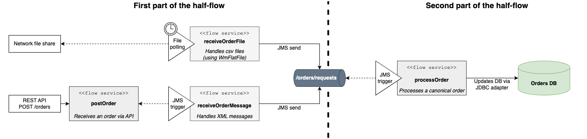
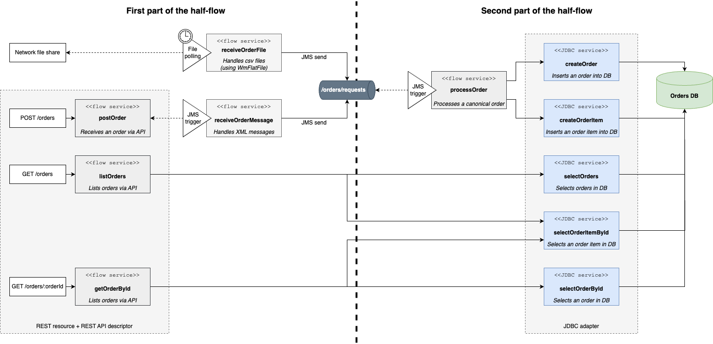

# Scenario Architecture

## Overview

This integration scenario implements a **half-flow** pattern: multiple inbound channels receive orders in different formats, normalize them into a canonical representation, and forward them to a shared processing pipeline.

### Inbound channels (first part of the half-flow)

Three inbound channels feed into the pipeline:

| Channel | Trigger | Flow service | Description |
|---|---|---|---|
| REST API | `POST /orders` | `postOrder` | Receives an order submitted via HTTP |
| JMS | JMS trigger (`postedOrder`) | `receiveOrderMessage` | Consumes XML order messages from the `/orders/posts` queue |
| File | File polling (`orderfile_polling`) | `receiveOrderFile` | Picks up pipe-delimited CSV files from a monitored directory |

All three channels normalize the inbound order into a **canonical document type** and publish it to the `/orders/requests` JMS queue.

### Processing pipeline (second part of the half-flow)

A JMS trigger (`newOrder`) listens on `/orders/requests` and dispatches each message to the `processOrder` flow service, which persists the order to the **Orders DB** via a JDBC adapter.

---

## Detailed View

### REST API

The package exposes a REST API defined by the [`OrdersAPI` descriptor](../api/OrdersAPI.yaml) (Swagger 2.0, base path `/OrdersAPI`):

| Method | Resource | Flow service | Description |
|---|---|---|---|
| `POST` | `/orders` | `postOrder` | Submit a new order → publishes to `/orders/requests` |
| `GET` | `/orders` | `listOrders` | List all orders → queries DB directly via `selectOrders` |
| `GET` | `/orders/{orderId}` | `getOrderById` | Retrieve a specific order → queries DB via `selectOrderById` |

The two GET endpoints bypass the JMS pipeline and query the database directly.

### JMS inbound channel

The JMS trigger `postedOrder` listens on the `/orders/posts` queue (using `DEFAULT_IS_JMS_CONNECTION`). On each message, it invokes `receiveOrderMessage`, which calls `mapOrderMessage` to transform the XML payload into the canonical format before publishing to `/orders/requests`.

### File inbound channel

The file polling listener `orderfile_polling` monitors the `files/incoming` directory at a 60-second interval. On each file detected, it invokes `receiveOrderFile`, which calls `mapOrderFile` to parse the pipe-delimited CSV using the `ordersCSVschema` flat file schema (WmFlatFile), then publishes each order row to `/orders/requests`.

File lifecycle directories:

| Directory | Role |
|---|---|
| `files/incoming` | Drop zone — files to be processed |
| `files/work` | In-progress processing |
| `files/processed` | Successfully processed files |
| `files/error` | Files that failed processing |

### Canonical data model

All inbound channels normalize orders into the `OrderCanonical` document type. This is the internal representation shared across all processing services.

| Field | Description |
|---|---|
| `id` | Unique order identifier |
| `date` | Order creation date |
| `status` | Order status (e.g. `PENDING`, `CONFIRMED`) |
| `currency` | ISO 4217 currency code (e.g. `EUR`, `USD`) |
| `customer.id` | Customer identifier |
| `customer.name` | Full name of the customer |
| `customer.email` | Customer email address |
| `shippingAddress.street` | Street and number |
| `shippingAddress.city` | City |
| `shippingAddress.postalCode` | Postal / ZIP code |
| `shippingAddress.country` | ISO 3166-1 alpha-2 country code (e.g. `FR`, `DE`) |
| `items[].id` | Product identifier |
| `items[].name` | Product name |
| `items[].quantity` | Ordered quantity |
| `items[].unitPrice` | Unit price |
| `items[].totalPrice` | Total price for this line (`quantity × unitPrice`) |

### Processing and persistence

The JMS trigger `newOrder` listens on `/orders/requests` and invokes `processOrder` for each message. `processOrder` delegates to JDBC adapter services connected via the `orders_postgres` alias:

| JDBC service | Operation | Table |
|---|---|---|
| `createOrder` | INSERT | `orders` |
| `createOrderItem` | INSERT | `order_items` |
| `selectOrders` | SELECT | `orders` |
| `selectOrderById` | SELECT | `orders` |
| `selectOrderItemsById` | SELECT | `order_items` |

### Database schema

The schema is provisioned by [`resources/databases/orders.ddl.sql`](../../resources/databases/orders.ddl.sql) and consists of two tables:

- **`orders`** — one row per order, holding order metadata, customer info, shipping address, and financial totals.
- **`order_items`** — one row per line item, with a composite primary key `(order_id, line_number)` and a foreign key referencing `orders`.

---

## Required Server-Level Configuration

The following resources must be configured on the webMethods Integration Server instance before deploying this package:

### JDBC connection alias

| Property | Value |
|---|---|
| Alias name | `demoOrderManagement.jdbc:orders_postgres` |
| Adapter | JDBC (WmJDBCAdapter) |
| Driver | `org.postgresql.ds.PGSimpleDataSource` |
| Host | `localhost` (override for target environment) |
| Port | `5432` |
| Database | PostgreSQL — schema provisioned via `orders.ddl.sql` |
| Pool min/max | 1 / 10 |
| Transaction | LOCAL_TRANSACTION |

> The PostgreSQL JDBC driver JAR must be installed in the Integration Server classpath.

### JMS connection alias

| Property | Value |
|---|---|
| Alias name | `DEFAULT_IS_JMS_CONNECTION` |
| Used by | JMS triggers `newOrder` and `postedOrder`, and all JMS send operations |

The JMS provider must expose two queues: `/orders/requests` and `/orders/posts`.

### File polling listener

| Property | Value |
|---|---|
| Listener name | `orderfile_polling` |
| Protocol | FilePolling (WmFlatFile) |
| Monitor directory | `files/incoming` |
| Polling interval | 60 seconds |
| Processing service | `demoOrderManagement.services:receiveOrderFile` |

The directories `files/incoming`, `files/work`, `files/processed`, and `files/error` must exist and be accessible by the IS process. The path is relative to the IS instance working directory.
