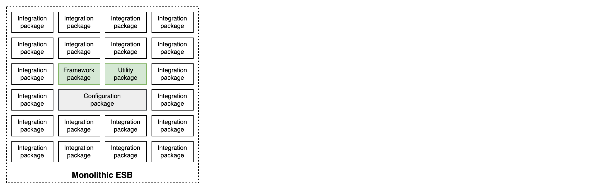
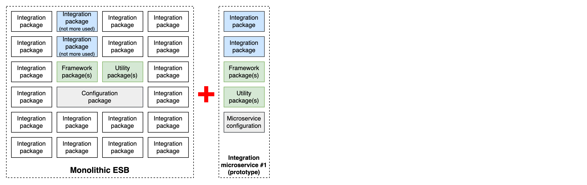
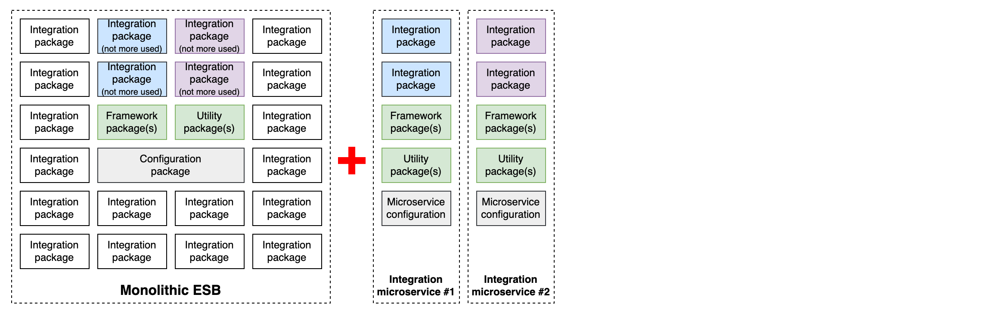
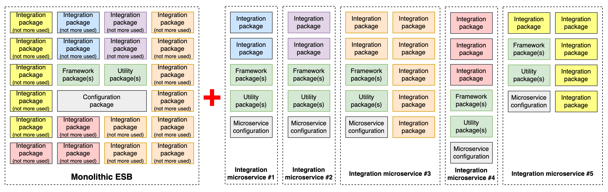
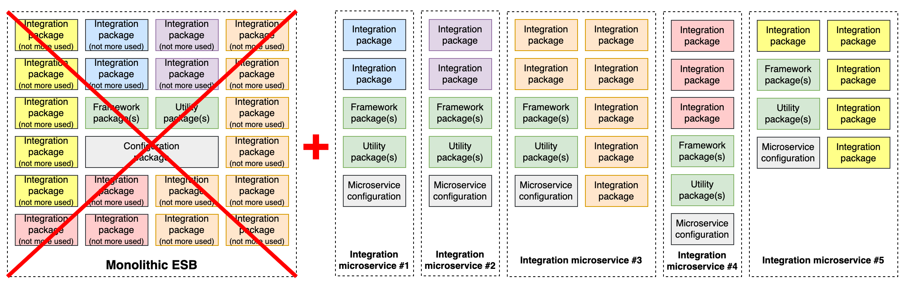

# Breaking the Monolith

A traditional webMethods Integration Server deployment tends to become a monolith over time: a single IS instance hosts dozens or hundreds of packages, covering unrelated functional domains, maintained by different teams, and deployed together as a single unit. Breaking this monolith into integration microservices requires deciding where to draw the boundaries.

The fundamental principle behind any decomposition is **cohesion**: a microservice should group things that change together, are deployed together, and are owned together. A boundary is well-drawn when crossing it is rare and deliberate — and poorly drawn when a single business change constantly requires touching multiple services simultaneously.

The ultimate goal is **agility at multiple levels**: faster and safer deployments (each service is independently deployable), better scalability (each service can be sized for its own load), clearer ownership (each service belongs to one team), and a codebase that can evolve without the entire organization moving in lockstep.

There is no single right answer on where to draw the lines — boundaries can be drawn along technical, functional, or organizational axes, and in practice the three are combined.

## Partitioning criteria

### Technical partitioning

Split by technical nature of the flows. Meaningful boundaries include:

- **API vs batch** — real-time API flows and batch/file-based processing have very different runtime characteristics (latency requirements, throughput, scaling behaviour). Separating them allows each to be sized and scaled independently.
- **Half-flow layers** — in a canonical half-flow architecture, the inbound normalization layer (receiving, mapping to canonical format, publishing to a queue) and the processing layer (consuming from the queue, persisting, routing) are natural candidates for separate microservices. This is the split illustrated in this repository.
- **Inbound vs outbound** — flows that receive data from external systems and flows that push data out can be separated, especially when they involve different protocols or SLA requirements.

This axis maps well to existing IS package structures and is often the easiest starting point. The risk is producing services that are technically clean but still share business logic — a change to a business rule may require touching multiple services.

### Functional partitioning

Split by business domain or capability, following **Domain-Driven Design (DDD)** principles. The key concept is the *bounded context*: a clearly delimited area of the business with its own model, its own language, and its own rules. Each bounded context becomes a natural candidate for a microservice — or a small cluster of microservices. For example:

- Order management
- Invoicing
- Shipping notifications

This is the recommended long-term target. Each microservice owns a coherent slice of business functionality end-to-end, regardless of the protocols involved. Boundaries are stable because they follow the business, not the technology — and the business changes less often than the technical stack.

### Criticality and compliance partitioning

Isolate flows by their risk profile, SLA requirements, or regulatory constraints. This axis is often overlooked but can be decisive:

- **Criticality** — a flow that is business-critical (payment processing, order confirmation) should not share a runtime with non-critical batch jobs. An incident on a low-priority flow should never bring down a critical one.
- **Security and compliance** — flows that handle sensitive data (PII, financial data, health records) may be subject to specific regulatory requirements (GDPR, PCI-DSS, HIPAA). Isolating them in a dedicated microservice makes it easier to apply stricter security controls, restrict network access, enforce audit logging, and scope compliance audits.

In practice this axis often refines a functional or organizational boundary: two flows in the same domain may still warrant separation if one carries regulated data and the other does not.

### Organizational partitioning

Follow team boundaries — Conway's Law states that the architecture of a system tends to mirror the communication structure of the organization that produces it. Rather than fighting this, use it deliberately: assign ownership of each microservice to a single team, and draw boundaries where team handoffs occur.

This axis is often the most pragmatic starting point in large organizations, as it reduces coordination overhead and gives teams clear ownership.

### In practice

These four axes are not mutually exclusive — a good decomposition typically satisfies all four simultaneously: each microservice is technically coherent, covers a well-defined functional scope, and is owned by a single team.

## Methodology

### The Strangler Fig pattern

Deciding where to draw boundaries is one challenge. Executing the migration without disrupting the running platform is another. The **Strangler Fig** pattern is the standard approach for this, widely used in microservices migrations and directly applicable to ESB decomposition.

The idea, borrowed from the strangler fig tree that slowly envelops and replaces its host, is to migrate incrementally rather than in a single cutover:

1. **Identify a candidate flow** — pick a well-bounded, lower-risk integration as the first target. Apply the partitioning axes above to select it.
2. **Build the microservice alongside the monolith** — implement the flow as a new, independent microservice. The existing IS package continues to run.
3. **Route traffic to the new service** — redirect the relevant inbound channel (API calls, JMS messages, file drops) to the microservice. The monolith handles everything else unchanged.
4. **Decommission the old flow** — once the microservice is stable in production, remove the corresponding flow from the monolith.
5. **Repeat** — progressively migrate flows, one at a time, until the monolith is empty enough to be decommissioned.

At no point is there a big-bang cutover. The monolith shrinks gradually while the microservice estate grows, and each migration is independently reversible.

**Applied to an IS monolith**, the routing step deserves attention. Depending on the inbound channel:
- **REST/HTTP APIs** — an API gateway or ingress rule can redirect specific paths to the new microservice while leaving others on the IS.
- **JMS flows** — the JMS trigger in the monolith is disabled; the microservice subscribes to the same queue or topic.
- **File polling** — the polling listener in the monolith is stopped; the microservice takes over the watched directory.

The strangler fig does not require the monolith and the microservice to coexist indefinitely — the goal is always to complete the migration and retire the old flow. But it removes the need to migrate everything at once, which is rarely feasible in a production environment.

### Step by step example

#### S0 — The monolithic ESB

All packages run in a single IS runtime. Services can call each other in-memory across package boundaries. Two categories of packages play a horizontal role: **framework packages** (error handling, logging, auditing) and **utility packages** (shared transformations), both consumed widely across the estate. A dedicated **configuration package** centralises all environment-specific properties, making Deployer-based promotion straightforward.

#### S1 — First microservice (prototype)

The Strangler Fig pattern starts with a single, well-bounded candidate extracted from the monolith. The prototype is built to go to production — the goal is to validate the target architecture under real conditions: containerisation, orchestration, CI/CD pipeline, package extraction, externalised configuration.

Framework and utility packages are **duplicated** into the microservice rather than called remotely — in-memory calls are preserved for performance reasons, which matters given the call volumes these packages absorb.

Each microservice owns its configuration: the relevant properties are extracted from the central configuration package and managed independently, replacing the Deployer-based promotion model with externalised configuration (see [External Configuration](external-configuration.md)).

The monolith continues to run unchanged. Traffic for the migrated flow is redirected to the new microservice via the inbound channel.

This first production-grade microservice validates the business case hypotheses before committing to a full migration.

#### S2 — Migration in progress

If the prototype is successful, the pattern is applied to the next cohesive set of packages. A second microservice is extracted and put into production following the same approach: duplication of framework and utility packages, extraction of the relevant configuration, redirection of the inbound channel.

The monolith shrinks progressively as flows are migrated one batch at a time.

#### S3 — End of migration

The extraction process continues, one cohesive batch at a time, until all packages have been migrated. The monolith is now empty — all flows run as independent microservices.

#### S4 — Monolith decommissioned

Once all packages have been migrated, the monolith is decommissioned. In this example, migrated packages are kept in the ESB marked as unused — but they can equally be removed progressively, once a microservice has been running in production long enough to confirm it is stable.

At any point during the migration, a rollback to the monolith remains possible: redirecting the inbound channel back to the ESB is sufficient to revert a microservice to its previous state. This reversibility is a key risk mitigation factor of the Strangler Fig approach.

