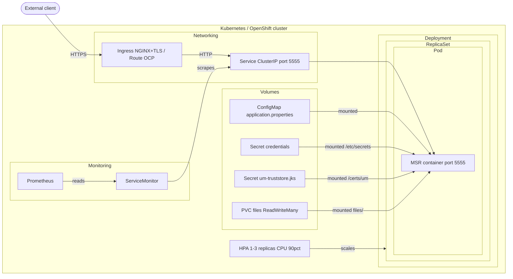

# Deployment in Kubernetes (and OpenShift)

Deploying a webMethods integration microservice in Kubernetes is not fundamentally different from deploying any other containerized application. There is nothing webMethods-specific about the manifests — the same patterns used for a Spring Boot microservice apply here. The same deployment works on OpenShift with minimal differences, covered below.

## Deployment overview



## TLS termination

The MSR exposes HTTP on port `5555`, like any standard web application. TLS termination is handled at the ingress/route level and follows the same options available for any HTTP service:

| Mode | Description |
|---|---|
| **Edge** | TLS is terminated at the ingress/route. Traffic inside the cluster is plain HTTP. Simple to set up — used in this example. |
| **Passthrough** | TLS is terminated inside the pod. The ingress forwards encrypted traffic as-is. Requires the MSR to be configured with a keystore. |
| **Re-encrypt** | TLS is terminated at the ingress, then re-encrypted for the leg between the ingress and the pod. |

## Kubernetes vs OpenShift

The only OCP-specific resource is `route.yaml`, which replaces the Ingress for external access. Everything else is identical.

The OCP compatibility requirement (group `0` permissions on the image filesystem) is handled at build time in the `Dockerfile` — see [Image Build](image-build.md).

## Helm charts

IBM Tech Expert Labs maintains a set of official Helm charts for webMethods components at [github.com/IBM/webmethods-helm-charts](https://github.com/IBM/webmethods-helm-charts). These charts cover a wide range of deployment use cases and can serve as a production-ready alternative to the raw manifests provided in this repository.

---

## This repository's example

The manifests in `resources/kubernetes/` can be used as a starting point for other integration microservice deployments. The structure is intentionally generic: adapt the names, resource limits, and volume configuration to suit the target service.

### Manifests overview

All manifests are assembled via [Kustomize](https://kustomize.io) — a Kubernetes-native configuration management tool, bundled with `kubectl` (`kubectl apply -k`).

| Manifest | Kind | Description |
|---|---|---|
| `service-account.yaml` | ServiceAccount | Dedicated service account for the pod |
| `config-map.yaml` | ConfigMap | Embeds the `application.properties` file |
| `pvc.yml` | PersistentVolumeClaim | Network storage for the file polling directory (`ReadWriteMany`, 1Gi, CephFS) |
| `deployment.yaml` | Deployment | Main deployment — rolling update strategy, resource limits, probes, volume mounts |
| `service.yaml` | Service | ClusterIP service on port `5555`, with session affinity |
| `ingress.yaml` | Ingress | NGINX ingress with TLS edge termination (Kubernetes) |
| `route.yaml` | Route | OpenShift route with TLS edge termination (OCP) |
| `hpa.yaml` | HorizontalPodAutoscaler | Autoscaling between 1 and 3 replicas, triggered at 90% CPU |
| `service-monitor.yaml` | ServiceMonitor | Prometheus scraping configuration |

Both `ingress.yaml` and `route.yaml` are included — remove whichever is not applicable to your target environment.

### Deploying

```sh
make kube-deploy TAG=<image-tag>
```

Updates the image tag in `kustomization.yaml` and applies all manifests to the configured namespace (`integration` by default).

```sh
make kube-deploy-status   # check rollout status
make kube-msr-logs        # follow MSR logs
make kube-undeploy        # remove all resources
```

### Running tests

Test the file inbound channel by injecting a CSV file directly into the PVC via a busybox helper pod:

```sh
make kube-test-file
```

Test the REST API:

```sh
make kube-test-api-post
make kube-test-api-list
make kube-test-api-list ORDER_ID=<order-id>
```
