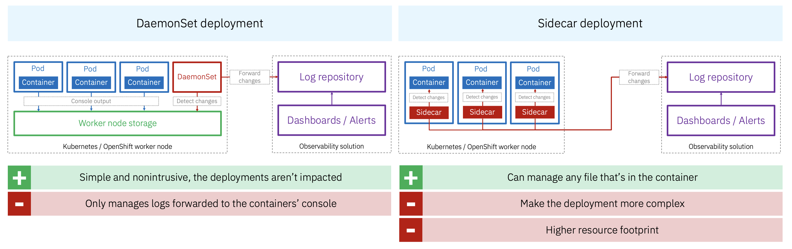

# Observability

Observability for distributed systems rests on three signals: **metrics**, **logs**, and **distributed traces**. The MSR provides native support for all three, and none of them require webMethods-specific tooling on the collection and visualisation side — standard infrastructure stacks apply.

---

## Metrics

The MSR exposes a Prometheus-compatible metrics endpoint out of the box. See the [official documentation](https://www.ibm.com/docs/en/webmethods-integration/wm-microservices-runtime/11.1.0?topic=guide-prometheus-metrics) for the full list of exposed metrics — they cover runtime health, thread pool usage, service execution statistics, JMS activity, and more.

The `ServiceMonitor` manifest in `resources/kubernetes/service-monitor.yaml` configures Prometheus to scrape the MSR automatically in a Kubernetes cluster with the Prometheus Operator installed.

For teams using an APM platform (Dynatrace, Instana, Datadog, etc.), an agent or exporter can be injected alongside the MSR container — either as a sidecar or via auto-instrumentation. This makes it straightforward to centralise MSR metrics alongside the rest of the application estate in a unified dashboard.

---

## Logs

Log centralisation for MSR pods follows the same patterns as any other containerised workload. Two standard Kubernetes architectures are available:

| | DaemonSet | Sidecar |
|---|---|---|
| **How it works** | A log collector runs as a DaemonSet on each worker node and forwards logs from all pods on that node | A log collector container runs alongside the MSR container in the same pod |
| **Impact on deployments** | None — pods are unchanged | Increases pod complexity and resource footprint |
| **Scope** | Console output only | Any file in the container filesystem |

The DaemonSet pattern is the simpler default and sufficient when MSR logs are written to stdout/stderr. The sidecar pattern is needed when logs are written to files inside the container (e.g. MSR server logs, audit logs) rather than forwarded to the console.

**webMethods-specific consideration:** the MSR produces logs in its own format. The log collector pipeline (Fluentd, Fluent Bit, Logstash, etc.) must be configured to parse this format correctly before forwarding to the log repository (Elasticsearch, Splunk, Loki, etc.).

---

## Distributed Traces

The MSR supports distributed tracing via the **webMethods End-to-End Monitoring** framework. See the [official documentation](https://www.ibm.com/docs/en/wm-end-to-end-monitoring?topic=self-hosted-transaction-monitoring) for full details.

**How it works:** install the `WmE2EMIntegrationAgent` package from `packages.webmethods.io` using `wpm`, and configure it to point to an OpenTelemetry collector. The agent emits traces in **OpenTelemetry format**, which means they can be forwarded to any OTEL-compatible backend — Jaeger, Zipkin, Grafana Tempo, Dynatrace, Instana, or the webMethods Hybrid Integration SaaS E2EM application.

Installation can be added to the `Dockerfile` in the same way as any other `wpm` package. This package is not installed in this repository's example.

**Important:** only services running in **audit mode** emit OTEL traces. The most practical way to control the scope of tracing is via the extended settings:

- `watt.server.audit.service.include` — comma-separated list of services to include
- `watt.server.audit.service.exclude` — comma-separated list of services to exclude

These settings can be configured in `application.properties` like any other MSR property.
