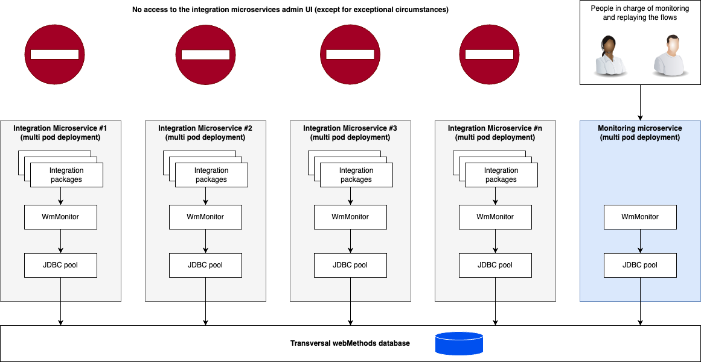

# webMethods Monitoring

## Overview

**WmMonitor** is the webMethods package responsible for tracking service and process executions and persisting that data to a database via a JDBC connection pool. This monitoring data can then be consulted and replayed from a dedicated monitoring UI.

WmMonitor is **not included in the official MSR base images** available from the webMethods container registry, and it cannot be installed via `wpm` — it is not published on [packages.webmethods.io](https://packages.webmethods.io). The only supported way to get it is to build a container image using the **standard webMethods installer**. This works well and can be fully automated, but the resulting image is larger and less optimized than images built on top of the official MSR base image (see [Image Build](image-build.md)).

## Architecture

Each integration microservice embeds WmMonitor alongside its business integration packages. A **dedicated monitoring microservice** — containing WmMonitor but no business packages — exposes the monitoring UI and is the single access point for operations teams.

> **The admin UI of integration microservices is off-limits**, except in exceptional circumstances. All flow consultation and replay is done exclusively through the monitoring microservice.

### Shared database: a pragmatic choice

All integration microservices and the monitoring microservice point their JDBC pool at the same **transversal webMethods database**. Every WmMonitor instance writes its execution data there, and the monitoring microservice reads across all of them from a single unified view.

Sharing a database between microservices is generally discouraged in a strict microservices architecture because it introduces data-level coupling. **This is a deliberate, pragmatic trade-off**: a shared database is the simplest way to centralise monitoring across a fleet of microservices. The alternatives — one monitoring UI per microservice, or an aggregation layer on top of separate databases — add operational or infrastructure complexity that is not justified here.

**This decision should be revisited if either of the following is observed:**
- **Performance bottleneck** — the shared database becomes a bottleneck under the combined write load of all microservices.
- **Coupling problems** — a schema migration or database outage affects all microservices simultaneously.

If that point is reached, the right move is to partition monitoring: each microservice (or logical group) gets its own monitoring database, and an aggregation layer is added if a unified view is still required.

## Flow replay

When an operator decides to replay a flow from the monitoring UI, WmMonitor needs to know which Integration Server instance to target for the reinjection. This is configured via the `watt.net.localhost` extended setting, which each integration microservice sets to the name of its **Kubernetes / OCP service**.

When replaying a flow from the monitoring microservice, WmMonitor uses this tag to route the reinjection request to the correct Kubernetes service, which load-balances it across the healthy pods of that microservice.

